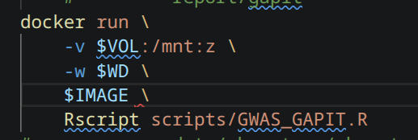
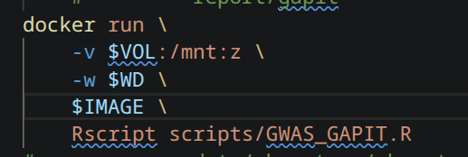

## LD - Heatmap
- LD = Linkage Disequilibrium
- non-random association

## Weird bash/docker behaviour

- I got the following **error**:

Run 'docker run --help' for more information
Error in library(impute) : there is no package called ‘impute’
Calls: suppressPackageStartupMessages -> withCallingHandlers -> library
Execution halted

- I assumed that certain packags where not installed, the second section indicted that !!
- **BUT:** It was just a a space to much in bash, which prevent the correct execution of `RScript` in the docker call ... what a waste of time ... :D

  | bad                       | good                       |
  | ------------------------- | -------------------------- |
  |  |  |

## GAPIT
- GAPIT = Genome Association and Prediction Integrated Tool)
- Detect SNPs (Marker in agriculture vocabulary) that have significant association with certain traits
- This is why GWAS is a detection of genomic regions with an association towards certain traits
- Also applicable in Medicine or Biology studies

## alpha value of marker
- This is basically just the slope of the genotype vs quantitative trait estimated regression (anstieg)